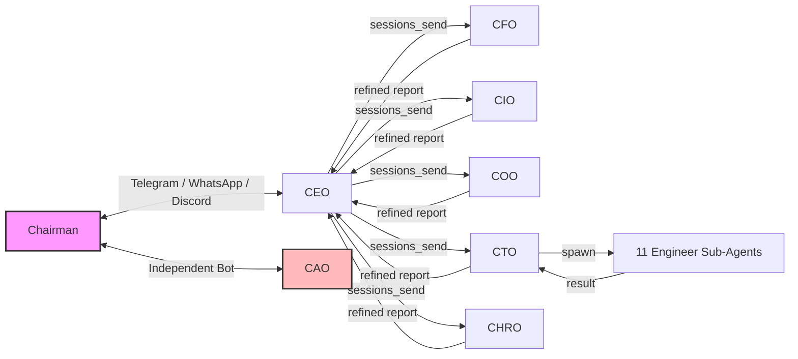
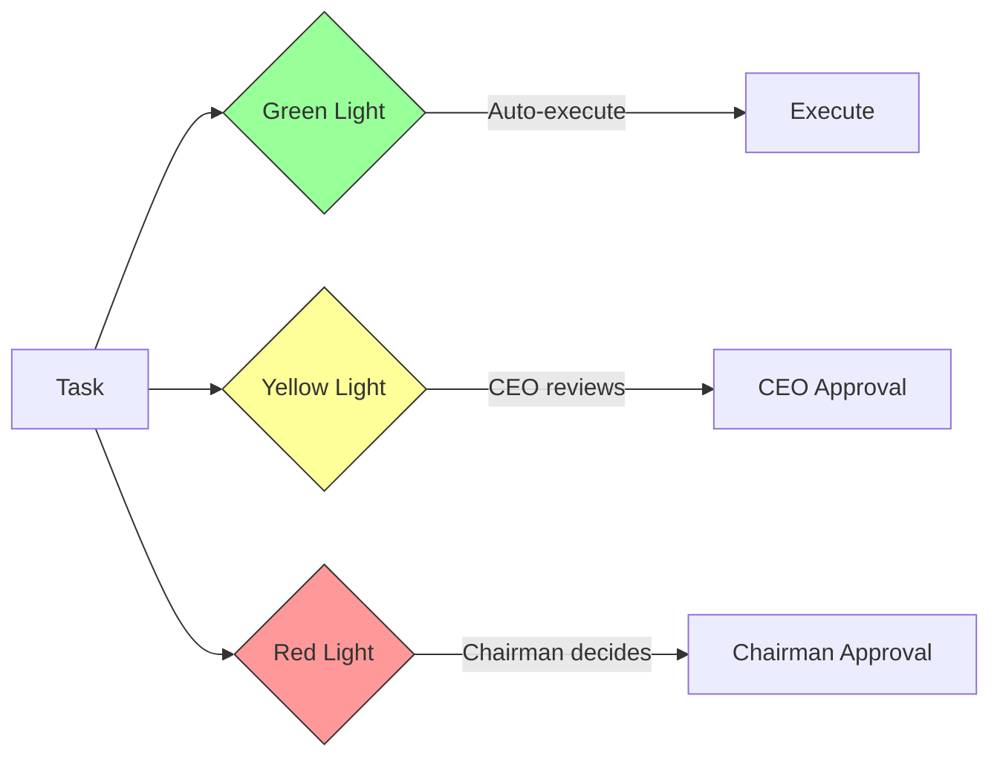
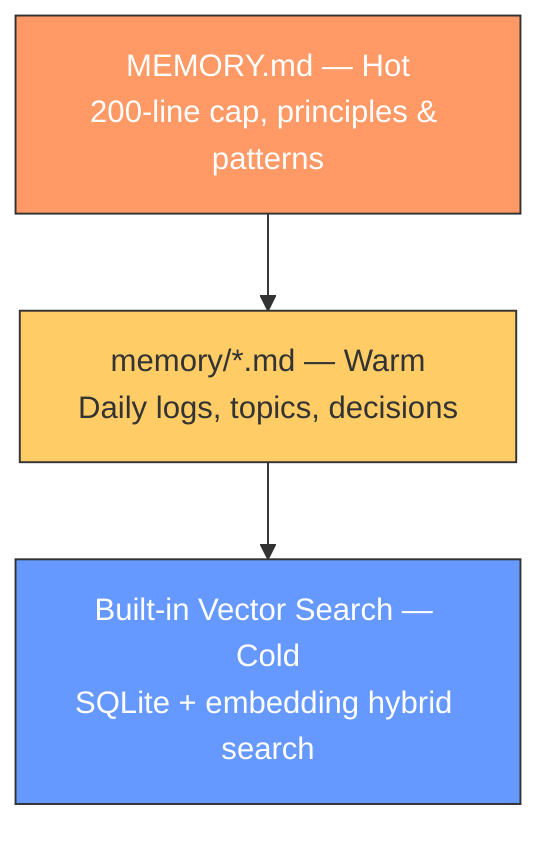
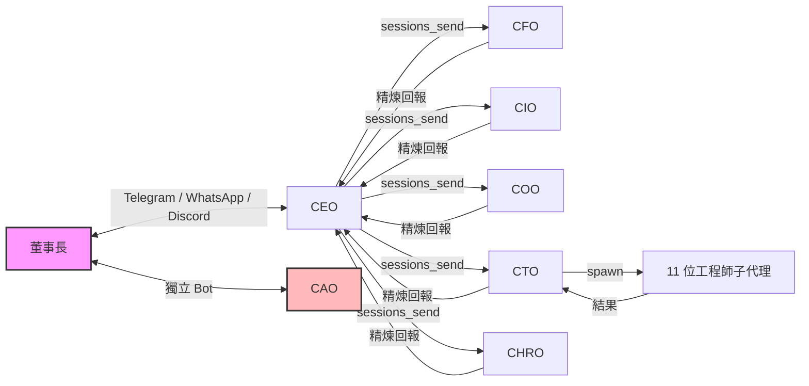
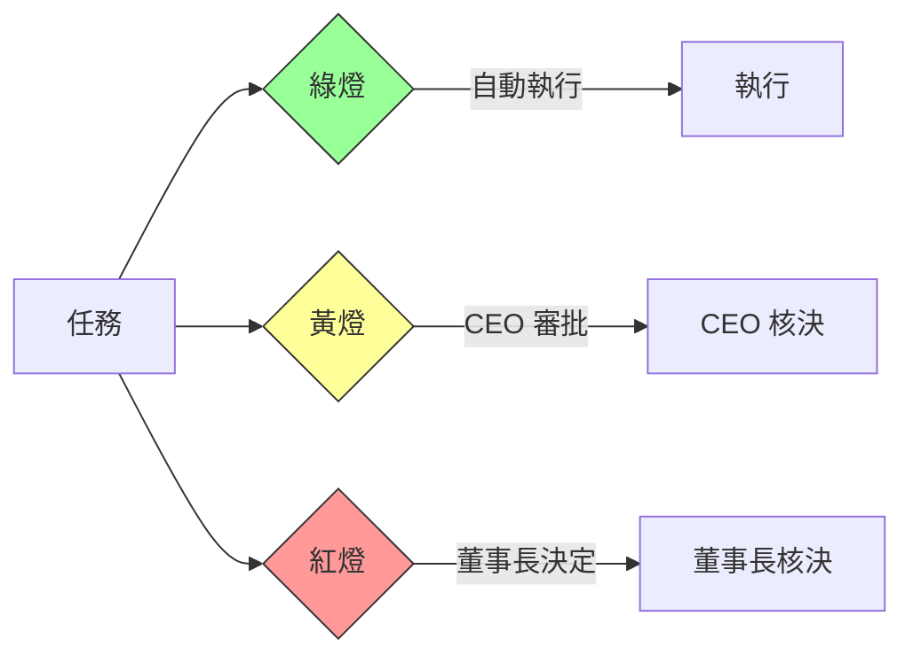
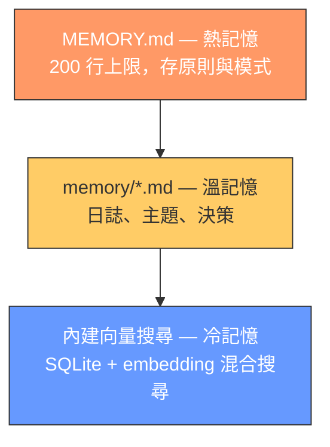

# Claw Company — One-Person Company Multi-Agent Architecture

[繁體中文](#繁體中文) | [English](#english)

---

## English

### Overview

Running a one-person company means you're the CEO, CFO, COO, and CTO all at once. Strategy, finance, operations, and product development all compete for your attention — and things inevitably slip through the cracks.

Claw Company is a **multi-agent AI architecture** that gives you a complete virtual C-suite. Built as an add-on for [OpenClaw](https://github.com/openclaw/openclaw), it orchestrates 7 specialized AI agents that handle everything from daily life management to product development — without taking over your existing OpenClaw setup.

The project supports **English** and **Traditional Chinese** — choose your language during setup.

### Architecture

```
Chairman (Human Owner)
  ↕ Telegram / WhatsApp / Discord
CEO (General Manager) — Coordination, delegation, refined reporting
  ├── CFO (Finance)    — Bookkeeping, budgeting, cost auditing
  ├── CIO (Investment) — Portfolio monitoring, market analysis
  ├── COO (Operations) — Scheduling, meals, travel, life management
  ├── CTO (Technology) — Product development, sub-agent management
  │     └── 11 Engineer Sub-Agents
  │          PM, Architect, Dev, QA, UX, Tech-Writer, Analyst, Scrum-Master, Solo-Dev, Spec-Reviewer, Code-Reviewer
  └── CHRO (HR)        — Agent capability assessment, policy writing

CAO (Auditor) — Independent oversight, reports directly to Chairman
```

#### Message Flow



- **CEO is the single gateway** — all messages flow through CEO for delegation and refinement
- **CTO spawns engineers** — the only agent that creates sub-agents for execution
- **CAO has an independent channel** — reports directly to Chairman, bypassing CEO

### Core Discipline

The system enforces engineering rigor through iron laws that **no agent can bypass or rationalize away**.

#### SDD — Solution Design Document

Every development task must pass a design readiness check before a single line of code is written. No design approval → no implementation. Three consecutive check failures → question the requirement itself.

#### TDD — Test-Driven Development

All coding tasks follow the RED → GREEN → REFACTOR cycle. Write a failing test first, make it pass, then refactor. No exceptions, no shortcuts.

#### Anti-Rationalization

LLMs are prone to convincing themselves that rules don't apply "in this case." Every iron law includes an **excuse-vs-fact table** that catches common rationalizations:

| Excuse | Fact |
|--------|------|
| "This is too small for the full process" | Rules define the boundaries, not your judgment |
| "I checked this before" | Memory is not evidence. Re-verify |
| "This is urgent, just do it" | Mistakes cost more than delays |

"Feeling like you don't need to follow the rules" is the biggest red flag of all.

#### Verification Before Completion

No agent may claim a task is done without **current, verifiable evidence**. "Should work" / "probably fine" / "checked it last time" = not verified.

### Workflows

**54 structured workflows** across all agents, covering the full lifecycle from analysis to implementation. Each workflow supports interruption recovery via YAML frontmatter.

#### CTO — Full Development Lifecycle

The CTO manages the complete engineering pipeline: analysis → planning → solutioning → implementation, plus a dev-dispatch skill that orchestrates brainstorming → scale assessment → task breakdown → sub-agent dispatch → two-phase review.

| Category | Workflows |
|---|---|
| Analysis | create-product-brief, research |
| Planning | create-prd (3 modes), create-ux-design |
| Solutioning | create-architecture, create-epics-and-stories, check-readiness |
| Implementation | dev-story, sprint-planning, create-story, code-review |
| Quick Flow | quick-spec, quick-dev |
| Testing | test-design, test-review, atdd, automate, framework, ci, trace, nfr |
| Support | sprint-status, correct-course, retrospective, document-project, generate-project-context |

#### C-Suite

| Agent | Workflows |
|---|---|
| CEO | dispatch-task, morning-briefing, brainstorming, deep-discussion, advisory-panel |
| CFO | record-expense, purchase-analysis, token-audit, monthly-closing, budget-alert |
| CIO | portfolio-monitor, investment-analysis, weekly-report, opportunity-scan |
| COO | meal-recommendation, trip-planning, schedule-management, weather-check, predictive-management |
| CHRO | agent-assessment, policy-drafting, model-evaluation, org-review, memory-audit, create-agent, knowledge-migration |
| CAO | security-scan, audit-issue, compliance-check, emergency-brake, soul-integrity |

### Governance

#### Three-Tier Approval



| Level | Approver | Examples |
|-------|----------|----------|
| Green | Auto-execute | Data collection, logging, routine heartbeat checks |
| Yellow | CEO approval | Spending proposals, investment recommendations, development plans |
| Red | Chairman approval | Expenses > $50, push to main, external communications |

#### Three-Way Checks

CEO (execution) ↔ CAO (oversight) ↔ CHRO (policy) — deadlocks resolved by Chairman.

#### Layered Memory



#### Other Principles

| Principle | Description |
|-----------|-------------|
| Layered Governance | AGENTS.md (index) → SOUL.md (role) → policies/ (details) |
| On-demand Loading | Policies loaded only when triggered, saving tokens |
| Refined Reporting | Layer-by-layer refinement; Chairman receives summaries only |
| Two-Phase Review | Spec compliance (Scout) → Code quality (Knox); fresh sub-agent per task; controller never fixes |

### Getting Started

#### Prerequisites

- [OpenClaw](https://github.com/openclaw/openclaw) >= 2026.3.7
- At least one LLM API Key configured in OpenClaw (Anthropic recommended)
- A messaging platform Bot Token (Telegram recommended; WhatsApp/Discord also supported)
- [Node.js](https://nodejs.org/) >= 18

#### Step 1 — Clone

```bash
git clone https://github.com/changanlee/claw-company.git
cd claw-company/claw-company-config
```

#### Step 2 — Customize Your Profile

Edit `{en|zh}/shared/USER.md` — replace the default Chairman profile with your own preferences.

#### Step 3 — Deploy

```bash
node install.js
```

The installer will interactively guide you through:
- Choosing a language (English or Chinese)
- Configuring Bot Tokens and messaging platform
- Selecting model tiers (smart/fast) for each agent
- Deploying workspace files to `~/.openclaw/claw-company/`
- Injecting agent configurations into your native OpenClaw setup
- Registering all 7 agents and 6 cron schedules

#### Step 4 — Start

```bash
openclaw gateway start
```

#### Step 5 — Test

Send a message to your CEO Bot via Telegram, e.g., "Hello, please introduce yourself."

### Agent ID Reference

All agents are registered with a `cc-` prefix to avoid naming conflicts in multi-project environments.

| Agent | ID | Role |
|-------|----|------|
| CEO | `cc-ceo` | Core coordinator |
| CFO | `cc-cfo` | Finance |
| CIO | `cc-cio` | Investment |
| COO | `cc-coo` | Operations |
| CTO | `cc-cto` | Technology |
| CHRO | `cc-chro` | Human Resources |
| CAO | `cc-cao` | Audit |

### Agent Model Configuration

The installer reads available models and lets you assign them to two tiers:

| Agent | Default Tier | Rationale |
|-------|-------------|-----------|
| CEO | smart | Core coordinator, needs strong reasoning |
| CFO | smart | Financial accuracy matters |
| CIO | smart | Investment analysis needs depth |
| COO | fast | Life tasks are frequent but simple |
| CTO | smart | Technical decisions need precision |
| CTO Sub-Agents | fast | Execution tasks |
| CHRO | fast | Policy tasks are periodic, not complex |
| CAO | smart | Audit requires independent strong reasoning |

### Cron Schedule

| Name | Agent | Schedule | Purpose |
|------|-------|----------|---------|
| morning-briefing | CEO | Daily 06:30 | Morning briefing |
| investment-monitor | CIO | Mon-Fri 09-16 hourly | Portfolio monitoring |
| memory-cleanup | CHRO | 1st of month 03:00 | Memory health review |
| weekly-org-review | CHRO | Monday 08:00 | Org health report |
| security-scan | CAO | Wednesday 02:00 | Security scan |
| cto-memory-cleanup | CTO | Sunday 03:00 | CTO memory self-cleanup |

### Upgrade & Uninstall

**Upgrade**: Re-run `node install.js`. The following data is preserved automatically: `MEMORY.md`, `output/`, `auth-profiles.json`.

**Uninstall**: Run `node install.js --uninstall` to remove installed files at `~/.openclaw/claw-company/`.

### Project Structure

```
claw-company/
├── claw-company-config/           # OpenClaw deployment configuration
│   ├── install.js                 # Cross-platform deployment script (Node.js)
│   ├── en/                        # English version
│   └── zh/                        # Chinese version
│       ├── shared/                # Shared policies & rules across all agents
│       │   ├── company-rules.md   # Company rules (runtime read)
│       │   ├── tools-policy.md    # Common tool policies (runtime read)
│       │   ├── brain-methods.csv  # 60 brainstorming techniques
│       │   ├── USER.md            # Chairman preferences
│       │   ├── policies/          # On-demand policy files
│       │   ├── standards/         # Format standards (agent, workflow)
│       │   ├── tasks/             # 8 shared task descriptions
│       │   └── setup-guides/      # Database & plugin setup guides
│       ├── skills/                # Custom OpenClaw Skills per agent
│       └── workspace-{agent}/     # Per-agent workspace
│           ├── IDENTITY.md        # Role identity
│           ├── SOUL.md            # Role personality & boundaries
│           ├── AGENTS.md          # Role responsibilities + startup-read
│           ├── TOOLS.md           # Tool policies + domain operations
│           ├── HEARTBEAT.md       # Heartbeat logic
│           ├── MEMORY.md          # Hot memory (200-line cap)
│           ├── workflows/         # Structured workflows
│           ├── templates/         # Output templates
│           └── output/            # Agent work output (preserved on upgrade)
├── README.md
└── LICENSE                        # MIT
```

### Credits

Built on [OpenClaw](https://github.com/openclaw/openclaw). Workflow architecture inspired by [BMAD Method](https://github.com/bmad-method/bmad-method). Engineering discipline informed by [Superpowers](https://github.com/superpowers-ai/superpowers).

### License

[MIT](LICENSE)

---

## 繁體中文

### 概述

經營一人公司意味著你同時是 CEO、CFO、COO 和 CTO。策略、財務、營運和產品開發全部搶奪你的注意力——總有事情會漏掉。

Claw Company 是一個**多代理人 AI 架構**，給你一整套虛擬高階管理團隊。作為 [OpenClaw](https://github.com/openclaw/openclaw) 的附加包，它協調 7 個專業 AI Agent，涵蓋日常生活管理到產品開發——不侵入你現有的 OpenClaw 設定。

本專案支援**英文**和**繁體中文**——部署時選擇你的語言即可。

### 架構

```
董事長（人類擁有者）
  ↕ Telegram / WhatsApp / Discord
CEO（總經理）— 統籌、分派、精煉回報
  ├── CFO（財務長）— 記帳、預算、成本審計
  ├── CIO（投資長）— 投資組合監控、市場分析
  ├── COO（營運長）— 行程、飲食、出行、生活管理
  ├── CTO（技術長）— 產品開發、工程師管理
  │     └── 11 位工程師子代理
  │          PM、Architect、Dev、QA、UX、Tech-Writer、Analyst、Scrum-Master、Solo-Dev、Spec-Reviewer、Code-Reviewer
  └── CHRO（人資長）— Agent 能力評估、政策撰寫

CAO（稽核長）— 獨立監督，直接向董事長報告
```

#### 訊息流



- **CEO 是唯一窗口** — 所有訊息經 CEO 分派與精煉
- **CTO 可 spawn 工程師** — 唯一擁有子代理的角色
- **CAO 有獨立通道** — 不經 CEO，直接向董事長報告

### 核心紀律

系統透過鐵律強制工程紀律，**任何 Agent 都不可繞過或合理化跳過**。

#### SDD — 方案設計文件

每個開發任務必須通過設計就緒檢查，才能寫一行程式碼。設計未批准 → 禁止實作。連續三次未通過 → 質疑需求本身。

#### TDD — 測試驅動開發

所有編碼任務遵循 RED → GREEN → REFACTOR 循環。先寫失敗測試，讓它通過，再重構。沒有例外，沒有捷徑。

#### 反合理化機制

LLM 容易說服自己「這次情況特殊，規則不適用」。每條鐵律都配有**藉口 vs 事實對照表**，攔截常見合理化：

| 藉口 | 事實 |
|------|------|
| 「這太小了，不需要完整流程」 | 規則定義邊界，不是你的判斷 |
| 「我之前確認過了」 | 記憶不是證據，重新驗證 |
| 「很急，先做再說」 | 錯誤的代價比延遲更高 |

「覺得不需要遵守規則」本身就是最大的紅旗。

#### 完成前驗證

任何 Agent 宣稱完成前，必須有**當前的、可驗證的證據**。「應該沒問題」/「上次確認過」= 未驗證。

### 工作流程

**54 個結構化工作流程**，涵蓋從分析到實作的完整生命週期。每個工作流程支援透過 YAML frontmatter 中斷續接。

#### CTO — 完整開發生命週期

CTO 管理完整的工程流水線：分析 → 規劃 → 方案 → 實作，加上開發派發技能，串連腦力激盪 → 規模評估 → 任務拆分 → 子代理派發 → 兩階段審查。

| 分類 | 工作流程 |
|------|---------|
| 分析 | create-product-brief、research |
| 規劃 | create-prd（3 種模式）、create-ux-design |
| 方案 | create-architecture、create-epics-and-stories、check-readiness |
| 實作 | dev-story、sprint-planning、create-story、code-review |
| 快速流程 | quick-spec、quick-dev |
| 測試 | test-design、test-review、atdd、automate、framework、ci、trace、nfr |
| 支援 | sprint-status、correct-course、retrospective、document-project、generate-project-context |

#### 高管

| 角色 | 工作流程 |
|------|---------|
| CEO 總經理 | dispatch-task、morning-briefing、brainstorming、deep-discussion、advisory-panel |
| CFO 財務長 | record-expense、purchase-analysis、token-audit、monthly-closing、budget-alert |
| CIO 投資長 | portfolio-monitor、investment-analysis、weekly-report、opportunity-scan |
| COO 營運長 | meal-recommendation、trip-planning、schedule-management、weather-check、predictive-management |
| CHRO 人資長 | agent-assessment、policy-drafting、model-evaluation、org-review、memory-audit、create-agent、knowledge-migration |
| CAO 稽核長 | security-scan、audit-issue、compliance-check、emergency-brake、soul-integrity |

### 治理機制

#### 三級核決



| 燈號 | 核決者 | 範例 |
|------|--------|------|
| 綠燈 | 自動執行 | 資料收集、內部記錄、例行心跳巡檢 |
| 黃燈 | CEO 核決 | 花費提案、投資建議、開發方案 |
| 紅燈 | 董事長核決 | 花費 >$50、推送 main、對外通訊 |

#### 三方制衡

CEO（執行）↔ CAO（監督）↔ CHRO（政策）— 僵局由董事長裁決。

#### 記憶分層



#### 其他原則

| 原則 | 說明 |
|------|------|
| 治理分層 | AGENTS.md（索引）→ SOUL.md（角色）→ policies/（詳細規範） |
| 按需載入 | policies/ 只在觸發情境時讀取，節省 Token |
| 精煉回報 | 逐層精煉，董事長只收到摘要，不收原始資料 |
| 兩階段審查 | 規格合規（Scout）→ 程式碼品質（Knox）；每任務新鮮 sub-agent；controller 不修復 |

### 快速開始

#### 前置條件

- 已安裝 [OpenClaw](https://github.com/openclaw/openclaw) >= 2026.3.7
- 至少一組已在 OpenClaw 中配置的 LLM API Key（推薦 Anthropic）
- 一組通訊平台 Bot Token（推薦 Telegram；WhatsApp / Discord 也支援）
- [Node.js](https://nodejs.org/) >= 18

#### 步驟一 — Clone

```bash
git clone https://github.com/changanlee/claw-company.git
cd claw-company/claw-company-config
```

#### 步驟二 — 自訂你的身份

編輯 `{en|zh}/shared/USER.md` — 把預設的董事長資訊改成你自己的偏好。

#### 步驟三 — 部署

```bash
node install.js
```

安裝程式會互動式引導你完成：
- 選擇語言（英文或中文）
- 設定 Bot Token 與通訊平台
- 為每個 Agent 選擇模型等級（smart / fast）
- 部署 workspace 檔案到 `~/.openclaw/claw-company/`
- 注入 Agent 設定到你的原生 OpenClaw 配置
- 註冊全部 7 個 Agent 和 6 個排程任務

#### 步驟四 — 啟動

```bash
openclaw gateway start
```

#### 步驟五 — 測試

透過 Telegram 向 CEO Bot 發送訊息，例如：「你好，請自我介紹。」

### Agent ID 對照表

所有 Agent 註冊時加上 `cc-` 前綴，避免多專案命名衝突。

| Agent | ID | 角色 |
|-------|----|------|
| CEO 總經理 | `cc-ceo` | 核心協調 |
| CFO 財務長 | `cc-cfo` | 財務 |
| CIO 投資長 | `cc-cio` | 投資 |
| COO 營運長 | `cc-coo` | 營運 |
| CTO 技術長 | `cc-cto` | 技術 |
| CHRO 人資長 | `cc-chro` | 人力資源 |
| CAO 稽核長 | `cc-cao` | 稽核 |

### Agent 模型配置

安裝程式會讀取可用模型，讓你指定兩個等級：

| 角色 | 預設等級 | 原因 |
|------|---------|------|
| CEO 總經理 | smart | 核心協調者，需要強推理能力 |
| CFO 財務長 | smart | 財務準確性重要 |
| CIO 投資長 | smart | 投資分析需要深度 |
| COO 營運長 | fast | 生活任務頻繁但簡單，省 Token |
| CTO 技術長 | smart | 技術決策需要精確 |
| CTO 子代理 | fast | 執行任務 |
| CHRO 人資長 | fast | 政策任務是週期性的，不複雜 |
| CAO 稽核長 | smart | 稽核需要獨立的強推理能力 |

### 排程總覽

| 名稱 | 角色 | 時間 | 用途 |
|------|------|------|------|
| morning-briefing | CEO | 每日 06:30 | 晨間會報 |
| investment-monitor | CIO | 週一至五 09-16 每小時 | 投資監控 |
| memory-cleanup | CHRO | 每月 1 日 03:00 | 記憶審視 |
| weekly-org-review | CHRO | 週一 08:00 | 組織健康週報 |
| security-scan | CAO | 週三 02:00 | 安全掃描 |
| cto-memory-cleanup | CTO | 週日 03:00 | CTO 記憶自清理 |

### 升級與移除

**升級**：重新執行 `node install.js`。以下資料會自動保留：`MEMORY.md`、`output/`、`auth-profiles.json`。

**移除**：執行 `node install.js --uninstall`，移除安裝在 `~/.openclaw/claw-company/` 的檔案。

### 專案結構

```
claw-company/
├── claw-company-config/           # OpenClaw 部署配置
│   ├── install.js                 # 跨平台部署腳本（Node.js）
│   ├── en/                        # 英文版
│   └── zh/                        # 中文版
│       ├── shared/                # 跨 Agent 共用政策與規範
│       │   ├── company-rules.md   # 公司規範（啟動時載入）
│       │   ├── tools-policy.md    # 通用工具規範（啟動時載入）
│       │   ├── brain-methods.csv  # 60 個腦力激盪技法
│       │   ├── USER.md            # 董事長偏好
│       │   ├── policies/          # 按需載入政策文件
│       │   ├── standards/         # 格式標準（Agent、工作流程）
│       │   ├── tasks/             # 8 個共用任務描述
│       │   └── setup-guides/      # 資料庫與插件安裝指南
│       ├── skills/                # 自定義 OpenClaw Skill（各 Agent 專用）
│       └── workspace-{agent}/     # 各 Agent 工作區
│           ├── IDENTITY.md        # 角色身份
│           ├── SOUL.md            # 角色人格與邊界
│           ├── AGENTS.md          # 角色職責 + 啟動必讀
│           ├── TOOLS.md           # 工具規範 + 領域操作
│           ├── HEARTBEAT.md       # 心跳巡檢邏輯
│           ├── MEMORY.md          # 熱記憶（上限 200 行）
│           ├── workflows/         # 結構化工作流程
│           ├── templates/         # 產出範本
│           └── output/            # Agent 工作產出（升級時保留）
├── README.md
└── LICENSE                        # MIT 授權
```

### 致謝

Built on [OpenClaw](https://github.com/openclaw/openclaw). Workflow architecture inspired by [BMAD Method](https://github.com/bmad-method/bmad-method). Engineering discipline informed by [Superpowers](https://github.com/superpowers-ai/superpowers).

### 授權

[MIT](LICENSE)
