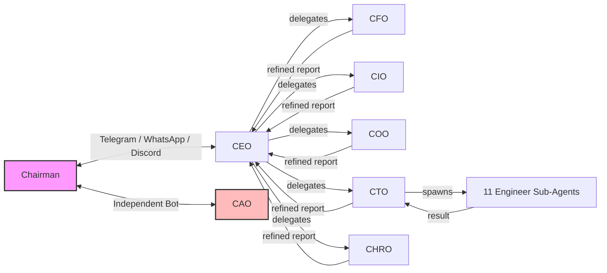
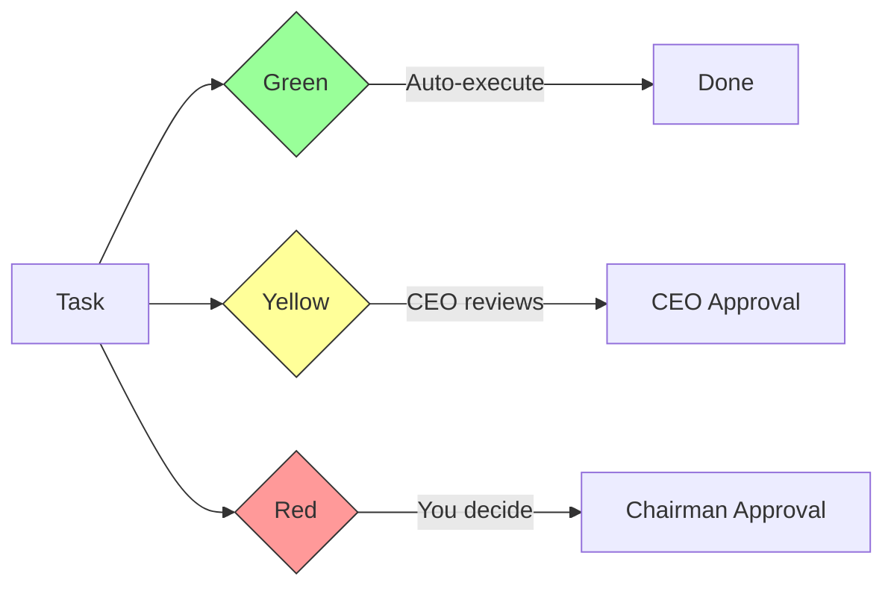
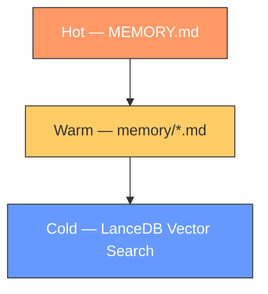

# Claw Company

**A virtual C-suite for one-person companies.** 7 AI agents handle your finance, investments, operations, product development, HR, and audit — you just talk to them on Telegram.

[繁體中文](README.zh-TW.md)

> Built as an add-on for [OpenClaw](https://github.com/openclaw/openclaw). Supports English and Traditional Chinese.

---

## Why?

Running a one-person company means you're the CEO, CFO, COO, and CTO all at once. Things slip through the cracks:

- You're deep in code and forget to reply to an important message
- You tracked expenses for three days, then stopped — and overspent by month's end
- Your portfolio dropped 8% while you weren't looking
- You wanted to build a side project, but planning + design + coding + testing + review all by yourself killed the momentum before you started

Claw Company gives you a full management team that works 24/7. Send a message on Telegram, and behind the scenes: delegation, execution, review, and reporting happen automatically.

**You're the Chairman — not a one-person sweatshop.**

---

## How It Works



| Agent | Role | Examples |
|-------|------|----------|
| **CEO** | Coordination & delegation | Routes tasks, morning briefings, brainstorming sessions |
| **CFO** | Finance | Bookkeeping, budget alerts, token cost auditing |
| **CIO** | Investment | Portfolio monitoring, market analysis, weekly reports |
| **COO** | Life operations | Scheduling, meal plans, trip planning, weather alerts |
| **CTO** | Product development | Spawns 11 engineer sub-agents (PM, Architect, Dev, QA, UX, etc.) |
| **CHRO** | HR & policy | Agent assessment, policy writing, model evaluation |
| **CAO** | Independent audit | Security scans, compliance checks — reports directly to you |

- **CEO is your single point of contact** — delegates and refines all reports before they reach you
- **CTO is the only agent that spawns sub-agents** — full engineering team on demand
- **CAO bypasses CEO** — independent oversight with its own Telegram bot

---

## Getting Started

### Prerequisites

- [OpenClaw](https://github.com/openclaw/openclaw) >= 2026.3.8
- At least one LLM API key configured (Anthropic recommended)
- A messaging platform bot token (Telegram recommended)
- [Node.js](https://nodejs.org/) >= 18

### Install

```bash
git clone https://github.com/changanlee/claw-company.git
cd claw-company/claw-company-config

# Edit your Chairman profile first
# vi {en|zh}/shared/USER.md

node install.js        # Interactive setup
openclaw gateway start # Launch
```

The installer handles language selection, model assignment, agent registration, cron scheduling, memory plugin setup, and skill allowlist injection.

### Verify

Send a message to your CEO bot: *"Hello, please introduce yourself."*

---

## Key Features

### Three-Tier Approval

No agent acts without appropriate authorization.



| Level | Approver | Examples |
|-------|----------|----------|
| Green | Auto | Data collection, logging, heartbeat checks |
| Yellow | CEO | Spending proposals, investment advice, dev plans |
| Red | You | Expenses > $50, push to main, external comms |

### Engineering Discipline

Every development task enforces iron laws that **no agent can bypass or rationalize away**:

- **SDD (Solution Design Document)** — Design must pass readiness check before any code is written. 3 consecutive failures → question the requirement itself.
- **TDD (Test-Driven Development)** — RED → GREEN → REFACTOR. No exceptions.
- **Anti-Rationalization** — Every iron law includes an excuse-vs-fact table. "Feeling like you don't need to follow the rules" is the biggest red flag.
- **Verification Before Completion** — No agent may claim done without current, verifiable evidence.

### Layered Memory

Agents don't forget between sessions. Three layers, each capturing different granularity:



| Layer | What it stores | How it works |
|-------|---------------|--------------|
| Hot | Refined principles & verified patterns | Agent writes manually; 200-line cap; auto-loaded every session |
| Warm | Daily event logs & decision records | Agent writes manually with tags; today + yesterday auto-loaded |
| Cold | Conversation context & historical solutions | `autoCapture` distills summaries at session end; `autoRecall` injects relevant memories at session start |

Cold layer powered by [memory-lancedb-pro](https://github.com/win4r/memory-lancedb-pro): hybrid vector + BM25 retrieval, cross-encoder rerank, multi-scope isolation (each agent has a private scope; all `cc-*` agents share a company scope).

### 54 Structured Workflows

Full lifecycle coverage from analysis to implementation, with interruption recovery via YAML frontmatter.

| Agent | Highlights |
|-------|-----------|
| CTO | Dev-dispatch orchestration: brainstorming → scale assessment → task breakdown → sub-agent spawn → two-phase review (spec compliance + code quality) |
| CEO | Task delegation, morning briefings, brainstorming, advisory panels |
| CFO | Expense tracking, purchase analysis, token cost auditing, monthly closing |
| CIO | Portfolio monitoring, investment analysis, weekly reports |
| COO | Meal recommendations, trip planning, schedule management, weather checks |
| CHRO | Agent assessment, policy drafting, memory audits, new agent creation |
| CAO | Security scans, compliance checks, emergency brake, SOUL integrity |

### Skill Access Control

Per-agent skill allowlist (`skill-allowlist.json`). Policy-sensitive agents (CHRO, CAO) are fully blocked. New skills require CTO security review + CAO compliance check + Chairman approval.

---

## Reference

### Agent IDs

All agents use a `cc-` prefix to avoid naming conflicts.

| Agent | ID | Default Model Tier |
|-------|----|-------------------|
| CEO | `cc-ceo` | smart |
| CFO | `cc-cfo` | smart |
| CIO | `cc-cio` | smart |
| COO | `cc-coo` | fast |
| CTO | `cc-cto` | smart |
| CHRO | `cc-chro` | fast |
| CAO | `cc-cao` | smart |
| CTO Sub-Agents | — | fast |

### Cron Schedule

| Name | Agent | Schedule | Purpose |
|------|-------|----------|---------|
| morning-briefing | CEO | Daily 06:30 | Morning briefing |
| investment-monitor | CIO | Mon-Fri 09-16 hourly | Portfolio monitoring |
| memory-cleanup | CHRO | 1st of month 03:00 | Memory health review |
| weekly-org-review | CHRO | Monday 08:00 | Org health report |
| security-scan | CAO | Wednesday 02:00 | Security scan |
| cto-memory-cleanup | CTO | Sunday 03:00 | CTO memory self-cleanup |

### Upgrade & Uninstall

```bash
node install.js                # Upgrade (preserves MEMORY.md, output/, auth-profiles.json)
node install.js --update-skills # Update skill allowlist only
node install.js --uninstall     # Remove installed files
```

### Project Structure

```
claw-company-config/
├── install.js                 # Cross-platform deployment script
├── skill-allowlist.json       # Per-agent skill access control
├── {en,zh}/
│   ├── shared/                # Company-wide policies, rules, templates
│   └── workspace-{agent}/     # Per-agent: AGENTS.md, SOUL.md, IDENTITY.md,
│                              #   TOOLS.md, HEARTBEAT.md, MEMORY.md,
│                              #   rules/, workflows/, templates/, output/
```

---

## Credits

Built on [OpenClaw](https://github.com/openclaw/openclaw). Workflow architecture inspired by [BMAD Method](https://github.com/bmad-method/bmad-method). Engineering discipline informed by [Superpowers](https://github.com/superpowers-ai/superpowers).

## License

[MIT](LICENSE)
