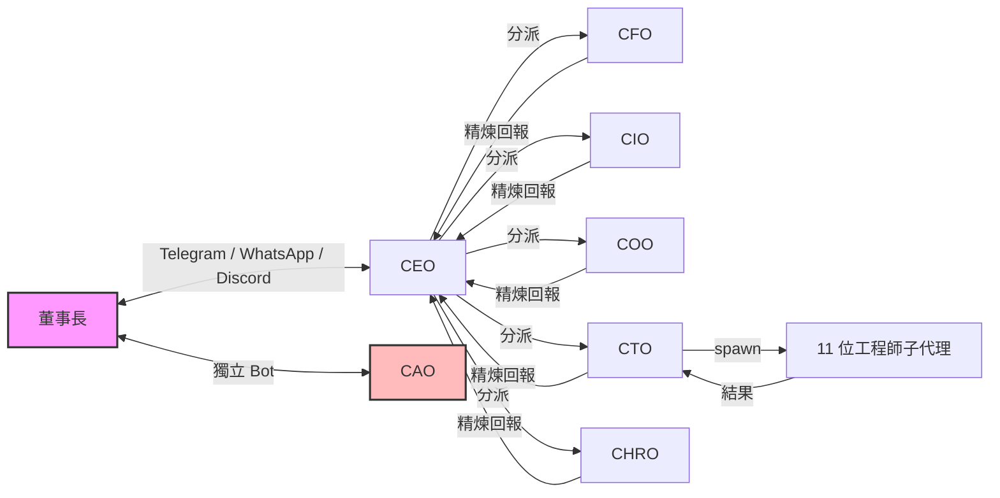
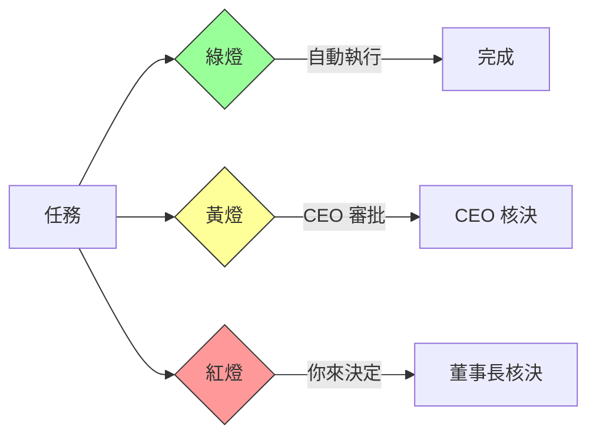
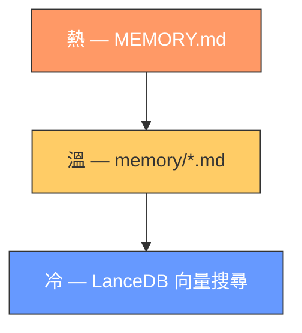

# Claw Company

**一人公司的虛擬高管團隊。** 7 個 AI Agent 幫你管財務、投資、生活、產品開發、人資和稽核——你只需要在 Telegram 上說一句話。

[English](README.md)

> 基於 [OpenClaw](https://github.com/openclaw/openclaw) 的附加包。支援英文和繁體中文。

> **注意：** 英文版（`en/`）目前延後更新，可能未反映最新變更。繁體中文版（`zh/`）是目前主要維護的版本。英文版將在正式發佈前同步。

---

## 為什麼需要 Claw Company？

經營一人公司意味著你同時是 CEO、CFO、COO 和 CTO。總有事情會漏掉：

- 寫程式寫到一半，忘了回覆重要訊息
- 記帳記了三天就斷掉，月底才發現超支
- 投資組合放著沒看，等到大跌才發現
- 想做一個 side project，但需求、設計、開發、測試全部自己來，光規劃就耗盡動力

Claw Company 讓 7 個 AI Agent 各司其職，全年無休。你在 Telegram 上說一句話，背後的分工、執行、審查、回報全自動完成。

**你是董事長——不是什麼都要自己來的個體戶。**

---

## 運作方式



| 角色 | 職責 | 範例 |
|------|------|------|
| **CEO 總經理** | 統籌分派 | 任務路由、晨間會報、腦力激盪 |
| **CFO 財務長** | 財務管理 | 記帳、預算警報、Token 成本審計 |
| **CIO 投資長** | 投資管理 | 投資組合監控、市場分析、週報 |
| **COO 營運長** | 生活管理 | 行程安排、飲食建議、出行規劃、天氣提醒 |
| **CTO 技術長** | 產品開發 | 可 spawn 11 位工程師子代理（PM、架構師、開發、QA、UX 等） |
| **CHRO 人資長** | 人資政策 | Agent 能力評估、政策撰寫、模型評估 |
| **CAO 稽核長** | 獨立監督 | 安全掃描、合規檢查——直接向你報告 |

- **CEO 是你的唯一窗口** — 分派任務、精煉回報，你只需要跟 CEO 溝通
- **CTO 是唯一可以 spawn 子代理的角色** — 按需組建完整工程團隊
- **CAO 不經 CEO** — 獨立稽核通道，有自己的 Telegram Bot

---

## 快速開始

### 前置條件

- 已安裝 [OpenClaw](https://github.com/openclaw/openclaw) >= 2026.3.8
- 至少一組 LLM API Key（推薦 Anthropic）
- 一組通訊平台 Bot Token（推薦 Telegram）
- [Node.js](https://nodejs.org/) >= 18

### 安裝

```bash
git clone https://github.com/changanlee/claw-company.git
cd claw-company/claw-company-config

# 先編輯你的董事長資料
# vi {en|zh}/shared/USER.md

node install.js        # 互動式安裝
openclaw gateway start # 啟動
```

安裝程式會處理語言選擇、模型指定、Agent 註冊、排程設定、記憶插件安裝和 Skill 白名單注入。

### 驗證

向 CEO Bot 發送訊息：*「你好，請自我介紹。」*

---

## 核心功能

### 三級核決

沒有適當授權，Agent 不會擅自行動。



| 燈號 | 核決者 | 範例 |
|------|--------|------|
| 綠燈 | 自動執行 | 資料收集、內部記錄、心跳巡檢 |
| 黃燈 | CEO 核決 | 花費提案、投資建議、開發方案 |
| 紅燈 | 你來核決 | 花費 >$50、推送 main、對外通訊 |

### 工程紀律

每個開發任務都受鐵律約束，**任何 Agent 都不可繞過或合理化跳過**：

- **SDD（方案設計文件）** — 設計未通過就緒檢查前，禁止寫一行程式碼。連續 3 次未通過 → 質疑需求本身。
- **TDD（測試驅動開發）** — RED → GREEN → REFACTOR。沒有例外。
- **反合理化** — 每條鐵律配有藉口 vs 事實對照表。「覺得不需要遵守規則」本身就是最大的紅旗。
- **完成前驗證** — 宣稱完成前，必須有當前的、可驗證的證據。

### 記憶分層

Agent 不會在對話結束後遺忘一切。三層記憶，各捕捉不同粒度：



| 層級 | 儲存什麼 | 如何運作 |
|------|---------|---------|
| 熱 | 精煉原則、已驗證模式 | Agent 手動寫入；200 行上限；每次 session 自動載入 |
| 溫 | 當日事件、決策記錄 | Agent 手動寫入並分類標籤；今天+昨天自動載入 |
| 冷 | 對話語境、歷史解法 | `autoCapture` 在 session 結束時自動萃取摘要；`autoRecall` 在 session 開始時注入相關記憶 |

冷層由 [memory-lancedb-pro](https://github.com/win4r/memory-lancedb-pro) 驅動：向量 + BM25 混合檢索、cross-encoder rerank、多重 Scope 隔離（每個 Agent 有私有 scope，所有 `cc-*` Agent 共享公司 scope）。

### 54 個結構化工作流程

涵蓋從分析到實作的完整生命週期，支援透過 YAML frontmatter 中斷續接。

| 角色 | 亮點 |
|------|------|
| CTO | 開發派發全流程：腦力激盪 → 規模評估 → 任務拆分 → 子代理派發 → 兩階段審查（規格合規 + 程式碼品質） |
| CEO | 任務分派、晨間會報、腦力激盪、諮詢委員會 |
| CFO | 記帳、採購分析、Token 成本審計、月結 |
| CIO | 投資組合監控、投資分析、週報 |
| COO | 飲食建議、出行規劃、行程管理、天氣檢查 |
| CHRO | Agent 評估、政策撰寫、記憶審計、新 Agent 建立 |
| CAO | 安全掃描、合規檢查、緊急煞車、SOUL 完整性 |

### Skill 存取控制

各 Agent 擁有獨立的 Skill 白名單（`skill-allowlist.json`）。政策敏感角色（CHRO、CAO）完全封鎖。新 Skill 需經 CTO 安全審查 + CAO 合規覆核 + 董事長核決。

---

## 參考

### Agent ID

所有 Agent 使用 `cc-` 前綴，避免命名衝突。

| 角色 | ID | 預設模型等級 |
|------|----|------------|
| CEO 總經理 | `cc-ceo` | smart |
| CFO 財務長 | `cc-cfo` | smart |
| CIO 投資長 | `cc-cio` | smart |
| COO 營運長 | `cc-coo` | fast |
| CTO 技術長 | `cc-cto` | smart |
| CHRO 人資長 | `cc-chro` | fast |
| CAO 稽核長 | `cc-cao` | smart |
| CTO 子代理 | — | fast |

### 排程總覽

| 名稱 | 角色 | 時間 | 用途 |
|------|------|------|------|
| morning-briefing | CEO | 每日 06:30 | 晨間會報 |
| investment-monitor | CIO | 週一至五 09-16 每小時 | 投資監控 |
| memory-cleanup | CHRO | 每月 1 日 03:00 | 記憶審視 |
| weekly-org-review | CHRO | 週一 08:00 | 組織健康週報 |
| security-scan | CAO | 週三 02:00 | 安全掃描 |
| cto-memory-cleanup | CTO | 週日 03:00 | CTO 記憶自清理 |

### 升級與移除

```bash
node install.js                # 升級（自動保留 MEMORY.md、output/、auth-profiles.json）
node install.js --update-skills # 僅更新 Skill 白名單
node install.js --uninstall     # 移除已安裝檔案
```

### 專案結構

```
claw-company-config/
├── install.js                 # 跨平台部署腳本
├── skill-allowlist.json       # 各 Agent Skill 存取控制
├── {en,zh}/
│   ├── shared/                # 全公司共用政策、規範、範本
│   └── workspace-{agent}/     # 各 Agent：AGENTS.md、SOUL.md、IDENTITY.md、
│                              #   TOOLS.md、HEARTBEAT.md、MEMORY.md、
│                              #   rules/、workflows/、templates/、output/
```

---

## 致謝

Built on [OpenClaw](https://github.com/openclaw/openclaw). Workflow architecture inspired by [BMAD Method](https://github.com/bmad-method/bmad-method). Engineering discipline informed by [Superpowers](https://github.com/superpowers-ai/superpowers).

## 授權

[MIT](LICENSE)
